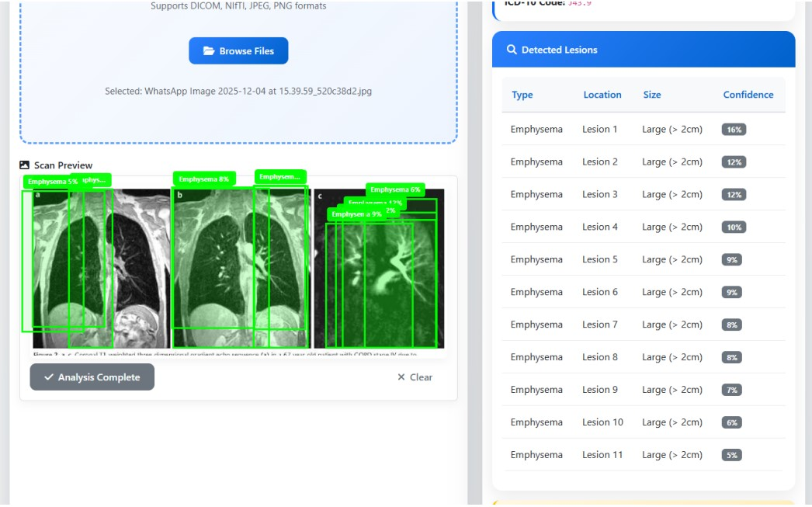
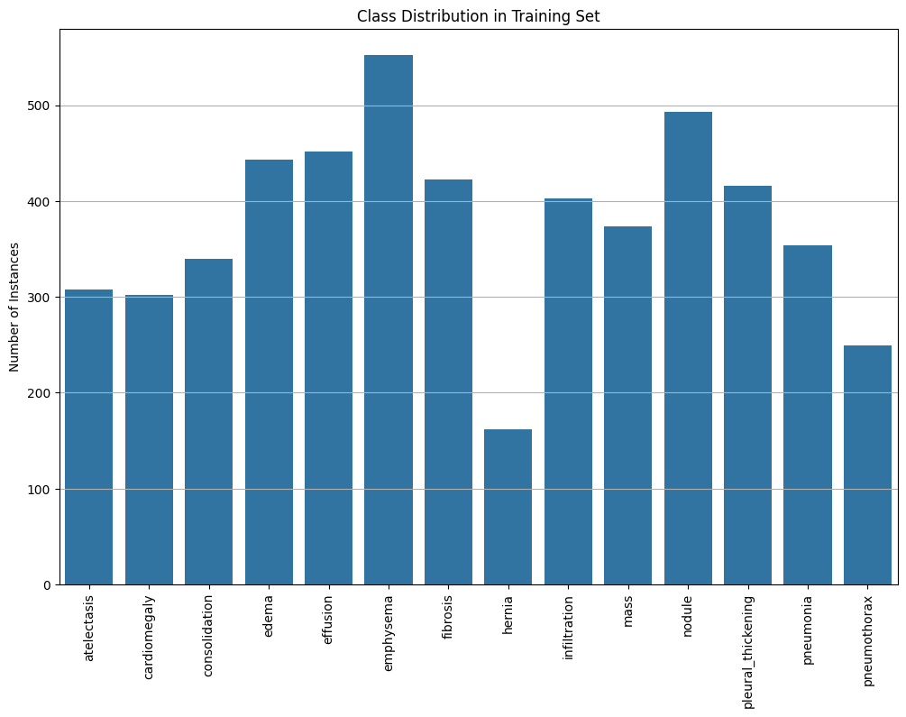

#  Lung Abnormality Detection System (YOLOv8, YOLOv10, RT-DETR)


##  1.0 Introduction
This project implements an AI-powered system to automatically detect and localize **14 different lung abnormalities** (e.g., Pneumonia, Cardiomegaly, Hernia) from chest X-rays.

Addressing the challenge of diagnostic variability and radiologist fatigue, we explored modern object detection architectures including **YOLOv8**, **YOLOv10**, and **RT-DETR**. The final deployed system utilizes **YOLOv8-Medium**, offering the best balance between training stability, detection accuracy, and computational efficiency for real-time medical analysis.

###  System Interface
The project features a user-friendly Drag-and-Drop interface for clinicians to upload scans and visualize AI predictions in real-time.


> *Figure: The final integrated system interface for Chest X-ray analysis.*

---

##  2.0 Dataset & Methodology

### 2.1 Data Collection
We utilized the **Lung Disease Diagnosis and Detection Dataset (DST2016)** containing **4,934 images**, standardized to YOLO format.
*   **Split Strategy:** 80% Train / 10% Validation / 10% Test.
*   **Preprocessing:** Images resized to 640x640, normalized, and converted to 3-channel format.

### 2.2 Exploratory Data Analysis (EDA)
As analyzed in `notebooks/01_EDA.ipynb`, the dataset exhibits significant class imbalance:
*   **Class Imbalance:** The data shows a **3.4x imbalance ratio**.
    *   *Most Common:* **Emphysema** (552 instances)
    *   *Rarest:* **Hernia** (162 instances)
*   **Bounding Box Distribution:** "Nodules" and "Pleural Thickening" have the smallest areas, making them the hardest to detect compared to "Cardiomegaly."


> *Figure: Class distribution showing prevalence of Emphysema vs. rare classes.*

### 2.3 Data Augmentation
To improve robustness against the imbalance and variations in patient positioning, we implemented advanced augmentation in `train_advanced.py`:
*   **Mosaic (1.0):** Combines 4 images to improve small object detection.
*   **Rotation (±15°):** Simulates patient misalignment.
*   **Scaling (0.5):** Handles variations in camera distance.

---

##  3.0 System Architecture & File Structure

The repository is organized into modular components for Backend, Frontend, and Analysis.
```text
Lung-AI-Project/
├── AI_frontend/                 # Frontend UI Assets (CSS/Images)
├── YOLOV8,YOLOV10,RT-DETER/     # Comparison experiments for other models
├── src/
│   └── api/                     # FastAPI Backend Server
├── notebooks/                   # EDA and Analysis Notebooks
├── ensemble_results/            # Visualizations of Model Ensembling
├── error_analysis_results/      # Failure cases (False Negatives)
├── train_model.py               # Baseline training script
├── train_advanced.py            # Advanced training with Hyperparameters
├── index.html / script.js       # Main User Interface Logic
└── README.md                    # Documentation
```

### 3.1 Model Selection
We evaluated three architectures. YOLOv8 Medium was chosen for deployment due to:
* **Stability:** More stable training convergence than YOLOv10 on this specific medical dataset.
* **Efficiency:** Faster inference speed than RT-DETR (Transformer-based), making it suitable for web deployment.

---

##  4.0 Validation & Results

### 4.1 Performance Metrics
We evaluated models based on mAP@0.5, Precision, and Recall.

| Experiment | Model | mAP50 | Observation |
|------------|-------|-------|-------------|
| Baseline | YOLOv8-Medium | 0.115 | Best balance. Strong on Cardiomegaly, weaker on Nodules. |
| Advanced | YOLOv8-Medium (Tuned) | 0.107 | Heavy augmentation caused slight underfitting due to limited epochs (40). |
| Comparison | YOLOv8-Nano | 0.140 | Converged fastest due to low parameter count. |

### 4.2 Error Analysis
Post-training analysis (`error_analysis.py`) identified key challenges:
* **Low Contrast:** Misses findings in "washed-out" X-rays where tissue density is unclear.
* **Small Lesions:** Tiny nodules (<5% image area) are lost due to 640x640 resizing.
* **Occlusion:** Findings behind the heart/diaphragm are frequently missed.

---

##  5.0 How to Run the System

### Prerequisites
```bash
pip install -r requirements.txt
```

### A. Run the Backend (API)
The FastAPI server handles image processing and inference.
```bash
# Navigate to the root folder
uvicorn src.api.main:app --reload
```

**Note:** Ensure the model weights (`lung_model.pt`) are placed in `src/models/` (Download from Drive).

### B. Run the Frontend (UI)
The system uses a responsive HTML/JS interface.

Simply open `index.html` in your web browser.

Drag and drop an X-ray image to see predictions.

---

##  6.0 Future Improvements
* **Weighted Loss:** Implement cls weights in YOLO to explicitly penalize missing rare classes like Hernia.
* **Higher Resolution:** Train at 1024x1024 using SAHI (Slicing Aided Hyper Inference) to improve small Nodule detection.
* **Ensembling:** Combine predictions from YOLOv8 and Faster R-CNN for higher recall.

---

##  License
This project is licensed under the MIT License.

##  Contributing
Contributions are welcome! Please open an issue or submit a pull request.

##  Contact
For questions or collaboration, please reach out via GitHub Issues.
